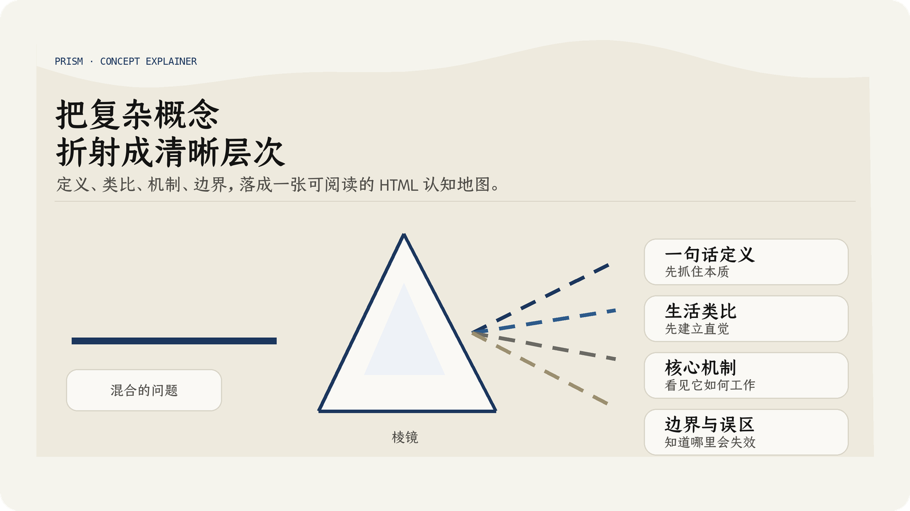
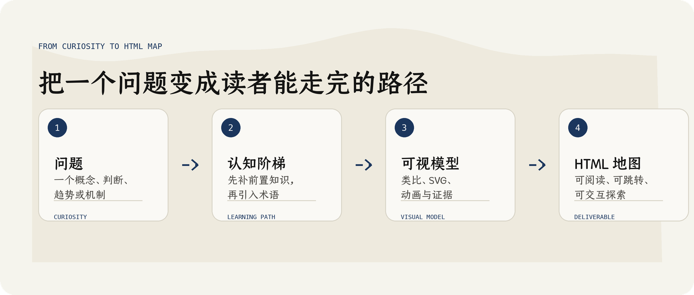

<div align="center">
  <h1>棱镜.Skill</h1>
  <p><b>把一个复杂概念折射成清晰、可视、可交互的 HTML 认知地图。</b></p>
  <p>
    
    
    
  </p>
  <p><a href="README_EN.md">English</a></p>
</div>



## 为什么叫 Prism

Prism 是“棱镜”。

棱镜不会凭空制造光，它把一束混在一起的光拆开，让人看见里面原本就存在的层次。这个 skill 做的也是同一件事：它不满足于给一个概念下定义，而是把概念里的前置知识、核心机制、生活类比、结构关系、误区和边界一层层拆开。

当你想理解一个新生事物、一个陌生产业、一个技术判断，或者只是想满足一点好奇心时，Prism 会把问题变成一张可以阅读、可以观察、可以交互探索的 HTML 认知地图。

## 它解决什么问题

很多解释型回答看起来信息很多，但读完以后只剩下几个词：定义、特点、应用、误区。它们没有真正回答“我为什么要这样理解它”。

Prism 的目标是让 AI 不只是解释概念，而是设计一条读者能走完的理解路径：

- 先补必要的前置知识。
- 再用生活场景建立直觉。
- 然后用 SVG 图解和动画演示机制。
- 最后讲清楚边界、误区和证据。

它特别适合这些请求：

- “帮我理解这个概念”
- “为什么有人这么判断”
- “这里面的逻辑和依据是什么”
- “这个产业现象背后发生了什么”
- “这个新东西为什么重要”
- “我需要先知道哪些知识”

默认交付不是一段聊天文本，而是一个可打开、可阅读、可交互的 `.html` 文件。

## 它会生成什么

Prism 会把一个问题整理成：

| 模块 | 作用 |
|---|---|
| 一句话定义 | 用 20 字以内抓住本质 |
| 阅读路线 | 先告诉读者理解这件事要经过哪几级台阶 |
| 生活类比 | 先用熟悉场景建立直觉，再引入术语 |
| 核心原理 | 用 SVG / CSS 动画演示机制，而不是只写段落 |
| 结构拆解 | 把内部组成、关系、边界画出来 |
| 常见误区 | 明确哪些说法听起来对但其实会误导 |
| 来源与边界 | 对调研型问题标出事实、推断、夸张和失效条件 |

典型页面包含：

- 右侧固定目录，滚动时自动高亮当前章节。
- 左下角阅读设置，可调字号、行距和页面宽度。
- 内联 CSS / JS，不依赖前端构建工具。
- 多张 SVG 图解，覆盖流程、结构、数据和状态变化。
- 对复杂或时效性问题，附带来源区和判断边界。



## 设计

Prism 继承了 [Kami](https://github.com/tw93/Kami) 的纸面美学：暖色羊皮纸、油墨蓝、衬线层级、克制的图形语言。Kami 让 AI 生成的文档更像一张经过设计的纸，而不是默认样式的灰色报告。

Prism 在这个基础上做了面向“概念解释”的改良：它不只追求好看，更强调抽象比喻、教学动画和可交互网页。它会把抽象知识变成能被观察的流程、结构、状态变化和边界条件，更适合解释一个概念、理解一个新生事物，满足读者的好奇心。

| 元素 | 规则 |
|---|---|
| 画布 | 暖色羊皮纸背景 `#f5f4ed`，避免纯白屏幕感 |
| 强调色 | 油墨蓝 `#1B365D` 作为唯一主强调色 |
| 字体 | 衬线字体主导层级，中文偏向纸面阅读质感 |
| 布局 | 窄正文、长留白、右侧目录，适合连续阅读 |
| 图解 | SVG 图解优先，动画必须服务教学目的 |
| 交互 | 只保留阅读设置、目录跳转、步骤演示等必要交互 |

Prism 的改良重点：

- 复杂概念先设计认知阶梯，不直接堆并列模块。
- 新术语先用生活场景和图解铺垫，再命名。
- 反直觉机制必须讲清现实承载物、适用边界和常见误解。
- 动画要有教学意图，不能只是装饰性的移动元素。
- 调研型问题要区分事实、推断、叙事夸张和失效条件。

## 安装

这个仓库的可安装 skill 位于：

```text
skills/prism/
```

### 自动安装

在 Codex 里，对 Codex 说：

```text
请帮我安装 Prism 这个 skill。
```

在 Claude Code 里，对 Claude Code 说：

```text
请帮我安装 Prism 这个 skill。
```

### 手动安装

如果你已经下载或 clone 了本仓库，复制整个 `skills/prism/` 文件夹：

| 工具 | 放到哪里 |
|---|---|
| Codex | `~/.codex/skills/prism/` |
| Claude Code | `~/.claude/skills/prism/` |

如果是支持上传的 Claude / Anthropic Skills，把 `skills/prism/` 文件夹里的内容打成 ZIP 上传。ZIP 根目录必须直接包含 `SKILL.md`，不要把整个仓库目录打进去。

## 文件结构

```text
skills/prism/
├── SKILL.md
├── template.html
├── agents/
│   └── openai.yaml
├── references/
│   ├── proto-data-charts.html
│   └── proto-flow-structures.html
└── assets/
    └── fonts/
        ├── JetBrainsMono.woff2
        ├── TsangerJinKai02-W04.ttf
        └── TsangerJinKai02-W05.ttf
```

- `SKILL.md`：Prism 的触发边界、工作流程、质量标准和交付契约。
- `template.html`：HTML 输出模板，包含目录、阅读设置、基础样式和交互脚本。
- `references/`：图表、流程和结构类 SVG 的参考样式。
- `assets/fonts/`：生成页面使用的字体资源。
- `agents/openai.yaml`：skill 在支持的界面中展示时使用的元数据。

## 授权

Prism 公开发布，免费供个人学习、交流、研究和实验使用。

未经书面允许，不得商用。禁止的商用场景包括但不限于：

- 出售本 skill 或其修改版本。
- 打包进付费产品、SaaS、课程、咨询交付物或商业工作流。
- 使用本 skill 或其主要内容为业务、客户服务或营收项目提供支持。
- 将本 skill 重新授权、转售或作为商业包的一部分分发。

完整条款见 `LICENSE`。

## 字体说明

`skills/prism/assets/fonts/` 中包含商用版权字体。它们随仓库保留，是为了让原始 skill 包在个人学习、交流和实验场景下保持完整。

本仓库不授予任何字体商用授权。任何人如果将这些字体用于商业用途，都需要自行向相关权利方取得合法授权，并自行承担由此产生的版权、授权、侵权或法律责任。

更多说明见 `THIRD_PARTY_NOTICES.md`。
