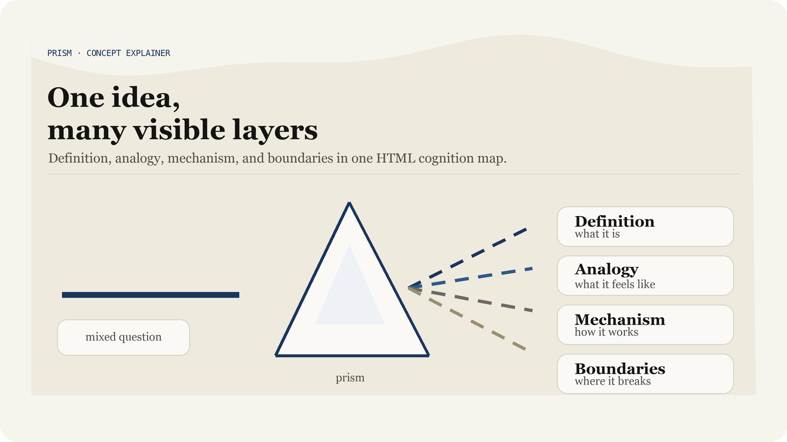
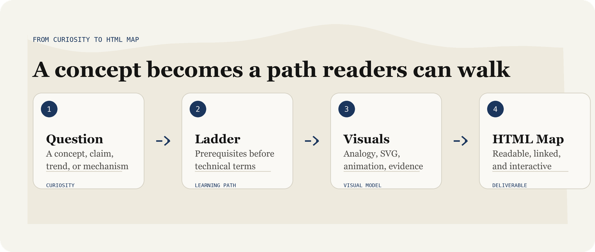

<div align="center">
  <h1>Prism</h1>
  <p><b>Turn a complex concept into a clear, visual, interactive HTML cognition map.</b></p>
  <p>
    
    
    
  </p>
  <p><a href="README.md">中文</a></p>
</div>



## Why Prism

A prism does not create light from nothing. It separates one mixed beam into visible layers.

This skill does the same thing for ideas. It does not stop at a dictionary-style definition. It separates a concept into prerequisites, mechanism, analogy, structure, misconceptions, evidence, and boundaries, so the reader can see how the idea actually works.

When you are trying to understand a new technology, a new industry, a fresh claim, or simply follow your curiosity, Prism turns the question into an interactive HTML cognition map.

## What it solves

Many AI explanations look informative, but they often collapse into a familiar checklist: definition, features, use cases, risks. The missing part is the learning path.

Prism asks the agent to build that path:

- Start with the prerequisite ideas.
- Use everyday analogies before technical terms.
- Show mechanisms through SVG diagrams and CSS animations.
- End with boundaries, misconceptions, and evidence.

It works well for prompts like:

- "Help me understand this concept."
- "Why do people make this claim?"
- "What is the logic and evidence behind this?"
- "What is happening underneath this new industry trend?"
- "What should I learn first?"

The default output is not a plain chat answer. It is a readable, inspectable, interactive `.html` file.

## What it creates

| Module | Purpose |
|---|---|
| One-sentence definition | Capture the core idea in one short sentence |
| Reading path | Show the steps the reader needs to climb |
| Everyday analogy | Build intuition before naming the technical term |
| Core mechanism | Use SVG / CSS animation instead of paragraph-only explanation |
| Structure map | Show components, relationships, and boundaries |
| Common misconceptions | Separate attractive but misleading explanations from better ones |
| Sources and boundaries | For research-heavy topics, separate facts, inference, narrative stretch, and failure cases |

Typical pages include:

- Fixed right-side table of contents with active section highlighting.
- Bottom-left reader settings for font size, line height, and content width.
- Inline CSS and JavaScript with no frontend build step.
- Multiple SVG diagrams for flows, structures, data, and state changes.
- Source and boundary sections for complex or time-sensitive questions.



## Design

Prism inherits the paper-like aesthetics of [Kami](https://github.com/tw93/Kami): warm parchment, ink blue, serif-led hierarchy, and restrained diagram language.

Prism adapts that language for concept explanation. It adds abstract analogies, teaching animations, and interactive HTML pages. The goal is not just to make an explanation look polished, but to make a new idea easier to inspect, explore, and understand.

| Element | Rule |
|---|---|
| Canvas | Warm parchment `#f5f4ed`, never a harsh white page |
| Accent | Ink blue `#1B365D` as the primary accent |
| Typography | Serif-led hierarchy with a paper-reading feel |
| Layout | Narrow reading column, generous whitespace, fixed table of contents |
| Diagrams | SVG first; animation must serve a teaching purpose |
| Interaction | Reader settings, TOC navigation, and step-by-step demos only when useful |

Prism's additions:

- Complex concepts start with a cognition ladder, not parallel topic blocks.
- New terms are named only after a scene and diagram establish intuition.
- Counterintuitive mechanisms explain real carriers, boundaries, and common mistakes.
- Animations must have a teaching intent, not decorative motion.
- Research-heavy topics distinguish fact, inference, narrative exaggeration, and failure cases.

## Installation

The installable skill lives at:

```text
skills/prism/
```

### Automatic install

In Codex, ask Codex:

```text
Please install the Prism skill.
```

In Claude Code, ask Claude Code:

```text
Please install the Prism skill.
```

### Manual install

If you have downloaded or cloned this repository, copy the entire `skills/prism/` folder:

| Tool | Destination |
|---|---|
| Codex | `~/.codex/skills/prism/` |
| Claude Code | `~/.claude/skills/prism/` |

For upload-based Claude / Anthropic Skills, zip the contents of the `skills/prism/` folder and upload that ZIP. The ZIP root must directly contain `SKILL.md`; do not zip the whole repository root.

## Structure

```text
skills/prism/
├── SKILL.md
├── template.html
├── agents/
│   └── openai.yaml
├── references/
│   ├── proto-data-charts.html
│   └── proto-flow-structures.html
└── assets/
    └── fonts/
        ├── JetBrainsMono.woff2
        ├── TsangerJinKai02-W04.ttf
        └── TsangerJinKai02-W05.ttf
```

- `SKILL.md`: trigger boundaries, workflow, quality standards, and delivery contract.
- `template.html`: HTML output template with table of contents, reader settings, base style, and interaction scripts.
- `references/`: reference patterns for chart, flow, and structure SVGs.
- `assets/fonts/`: font resources used by generated pages.
- `agents/openai.yaml`: metadata for supported skill interfaces.

## License

Prism is publicly available and free for personal learning, communication, research, and experimentation.

Commercial use is not allowed without prior written permission. This includes selling the skill, bundling it into paid products or services, using it in commercial workflows, or using modified versions for revenue-generating work.

See `LICENSE` for the full non-commercial license terms.

## Font notice

The bundled fonts in `skills/prism/assets/fonts/` include commercial copyrighted fonts. They are included only to preserve the original skill package for personal learning, communication, and experimentation.

This repository does not grant commercial font usage rights. Anyone who uses the bundled fonts commercially must obtain the proper font licenses independently and is solely responsible for any resulting legal or licensing issues.

See `THIRD_PARTY_NOTICES.md` for details.
